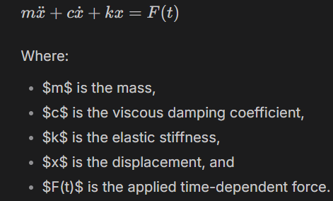

# RoadSoS PINN Code Explanation

Detailed teaching notes for `RoadSoS_PINN.ipynb`

Project context source: `00_Project_Overview/RoadSoS_Blueprint.md`

---

## 1. What This Notebook Is Building

`RoadSoS_PINN.ipynb` is a hackathon prototype for the predictive safety model inside the RoadSoS smart helmet.

RoadSoS has two AI jobs:

| AI Component | Safety Timeline | Purpose |
|---|---:|---|
| PINN | Before a crash | Predict skid or instability risk from IMU signals |
| Edge crash classifier | During or after impact | Confirm whether a real crash happened |

This notebook focuses mainly on the first part: a Physics-Informed Neural Network, or PINN. It also adds head-injury estimation using HIC15 and BrIC, then wraps the trained model in a Streamlit dashboard.

The notebook is not only a normal neural network demo. It tries to combine:

1. IMU sensor data from a helmet.
2. Motorcycle/two-wheeler motion physics.
3. Helmet/brain biomechanics.
4. Skid probability estimation.
5. Crash injury severity scoring.
6. A dashboard that looks like a live RoadSoS monitor.

---

## 2. Why a PINN Makes Sense for RoadSoS

A normal neural network learns only from examples. For RoadSoS, that is a problem because real crash data is rare, risky to collect, and expensive to label.

A PINN adds physics into the loss function. That means the model is trained to satisfy two things:

1. Match the synthetic training data.
2. Produce outputs that obey known physical equations.

For RoadSoS, this is useful because the helmet should predict dangerous conditions before a crash happens. The physics gives the model a built-in sense of how speed, lean angle, friction, acceleration, and impact forces should behave.

In simple terms:

```text
Normal ML:
  "Learn patterns from examples."

PINN:
  "Learn patterns from examples, but also obey physics."
```

---

## 3. Notebook Flow at a Glance

The notebook follows this pipeline:

```text
Install/import libraries
        |
Define physical constants
        |
Define the RoadSoS PINN model
        |
Generate synthetic riding, oil patch, and crash data
        |
Define HIC15 and BrIC injury metrics
        |
Define physics residuals
        |
Train the PINN
        |
Save model checkpoint as roadsos_pinn.pt
        |
Evaluate the model on three scenarios
        |
Generate dashboard plots
        |
Write a Streamlit dashboard app
        |
Launch Streamlit through ngrok for Colab
```

---

## 4. RoadSoS Blueprint Context

From the project blueprint, RoadSoS is a smart helmet with:

| Layer | Hardware/Software | Role |
|---|---|---|
| Sensing | IMU, GPS, vibration mic, ambient light | Collect motion and environment data |
| Edge inference | TinyML classifier plus PINN | Detect crash and predict instability |
| Communication | LoRa, cellular, BLE | Send SOS and warn nearby riders |
| Power | Battery plus solar film | Keep the helmet running during daily rides |

The notebook models the predictive and safety-analysis part of that larger system.

In the real RoadSoS helmet, IMU data would come from a sensor such as the ICM-42688-P. In this notebook, that data is simulated with Python functions.

---

## 5. Dependencies and Setup

The first code cell installs:

```python
!pip install torch numpy matplotlib pandas scipy streamlit pyngrok -q
```

The important libraries are:

| Library | Used For |
|---|---|
| `torch` | Neural network model, training, autograd |
| `numpy` | Synthetic data generation and numerical calculations |
| `matplotlib` | Training and evaluation plots |
| `streamlit` | Interactive dashboard |
| `pyngrok` | Public URL for the dashboard in Colab |

Then the notebook imports PyTorch, NumPy, Matplotlib, and sets:

```python
SEED = 42
torch.manual_seed(SEED)
np.random.seed(SEED)
DEVICE = torch.device("cuda" if torch.cuda.is_available() else "cpu")
```

This does two important things:

1. Makes experiments more repeatable.
2. Uses GPU if available, otherwise CPU.

---

## 6. Physical Constants

The notebook defines constants for the bike/rider system, road friction, injury thresholds, and brain biomechanics.

### 6.1 Vehicle Constants

```python
M_TOTAL   = 225.0
G         = 9.81
WHEELBASE = 1.35
```

Meaning:

| Constant | Meaning |
|---|---|
| `M_TOTAL` | Combined mass of rider and bike, 225 kg |
| `G` | Gravity, 9.81 m/s2 |
| `WHEELBASE` | Approximate distance between wheels, 1.35 m |

These constants are used in the physics equations for braking/friction and lean dynamics.

### 6.2 Road Friction Constants

```python
MU_DRY = 0.75
MU_WET = 0.45
MU_OIL = 0.15
```

The lower the friction coefficient, the more dangerous the road surface.

| Surface | Friction |
|---|---:|
| Dry road | 0.75 |
| Wet road | 0.45 |
| Oil patch | 0.15 |

The code later estimates skid risk by comparing predicted friction against the wet-road threshold.

### 6.3 Injury Constants

```python
HIC_LOW  = 700
HIC_HIGH = 1000
BRIC_X = 66.3
BRIC_Y = 56.5
BRIC_Z = 42.2
```

These are used to estimate head-injury risk:

| Metric | What It Measures |
|---|---|
| `HIC15` | Head Injury Criterion over a 15 ms window |
| `BrIC` | Brain Injury Criterion based on angular velocity |

HIC is mostly about linear acceleration. BrIC is about rotational motion.

### 6.4 Brain Biomechanics Constants

```python
M_BRAIN = 1.4
K_BRAIN = 2.1e4
C_BRAIN = 85.0
```

These approximate the brain as a Kelvin-Voigt spring-mass-damper system:



```text
mass * acceleration + damping * velocity + stiffness * displacement = helmet force input
```

This is not a full medical brain model. It is a simplified physics model that helps the notebook estimate how impact acceleration may translate into brain displacement risk.

---

## 7. The PINN Model Architecture

The main neural network class is:

```python
class RoadSoSPINN(nn.Module):
```

### 7.1 Model Input

The model receives 7 values:

```text
[t, ax, ay, az, gx, gy, gz]
```

| Input | Meaning |
|---|---|
| `t` | Time |
| `ax` | Linear acceleration along x |
| `ay` | Linear acceleration along y |
| `az` | Linear acceleration along z |
| `gx` | Angular velocity around x |
| `gy` | Angular velocity around y |
| `gz` | Angular velocity around z |

This matches the kind of signal produced by a 6-axis IMU plus time.

### 7.2 Model Output

The model outputs 6 values:

```text
[v, theta, mu_eff, x_brain, y_brain, z_brain]
```

| Output | Meaning |
|---|---|
| `v` | Vehicle speed |
| `theta` | Lean/tilt angle |
| `mu_eff` | Effective road friction |
| `x_brain` | Brain displacement estimate on x axis |
| `y_brain` | Brain displacement estimate on y axis |
| `z_brain` | Brain displacement estimate on z axis |

The friction output is passed through a sigmoid:

```python
"mu_eff": torch.sigmoid(o[:, 2:3])
```

That constrains `mu_eff` between 0 and 1, which makes physical sense for road friction in this simplified setup.

### 7.3 Hidden Layers

```python
dims = [7] + [hidden_width]*hidden_layers + [6]
```

By default:

```python
hidden_layers = 6
hidden_width = 128
```

So the network shape is:

```text
7 -> 128 -> 128 -> 128 -> 128 -> 128 -> 128 -> 6
```

Each hidden layer uses `tanh`.

Why `tanh` makes sense here:

1. It is smooth.
2. PINNs need derivatives through the network.
3. Smooth activations behave better when calculating physics residuals with autograd.

### 7.4 Weight Initialization

```python
nn.init.xavier_uniform_(m.weight)
nn.init.zeros_(m.bias)
```

Xavier initialization helps keep activations and gradients stable at the start of training.

---

## 8. Normalization Helper

The class:

```python
class IMUNormaliser:
```

stores mean and standard deviation for the input data.

It provides:

| Method | Purpose |
|---|---|
| `fit_transform` | Learn mean/std from training data and normalize it |
| `transform` | Normalize new data using saved mean/std |
| `inverse_transform` | Convert normalized data back to original scale |

This matters because IMU columns have very different ranges. For example, time may be 0 to 15, acceleration may be around 9.81, and gyro values may be much smaller. Neural networks train better when inputs have similar scale.

---

## 9. Synthetic Data Generation

The notebook does not train on real helmet data. It creates synthetic data for three scenarios.

### 9.1 Normal Riding

Function:

```python
simulate_normal(...)
```

It creates:

| Signal | Behavior |
|---|---|
| Speed `v` | Mostly steady with small oscillations |
| Lean `theta` | Small lean changes |
| Friction `mu` | Around dry-road friction |
| Acceleration | Mild noise and normal road movement |
| Gyro | Small angular velocities |
| Skid label | Zero |
| Scenario label | `0` |

This represents safe riding.

### 9.2 Oil Patch

Function:

```python
simulate_oil_patch(...)
```

It creates a sudden road-friction drop after `patch_start`.

Core idea:

```python
mu[pi:] = MU_OIL + (MU_DRY-MU_OIL)*dec
```

Meaning:

1. Before the oil patch, friction is dry-road level.
2. After the oil patch starts, friction drops toward oil-road level.
3. Speed decreases and lean angle grows.
4. Skid risk becomes high.

Scenario label is `1`.

### 9.3 Crash

Function:

```python
simulate_crash(...)
```

It creates:

| Crash Feature | How Code Simulates It |
|---|---|
| Sudden stop | Speed drops from `v0` to 0 |
| Impact pulse | Short high acceleration pulse |
| Fall/tilt | `theta` rises toward 90 degrees |
| Free-fall | `az` temporarily drops |
| Rotational impact | Gyro spikes |
| Friction loss | `mu` becomes oil-like |

Scenario label is `2`.

### 9.4 Dataset Builder

Function:

```python
build_dataset()
```

It combines:

| Scenario | Number of Seeds |
|---|---:|
| Normal | 4 |
| Oil patch | 4 |
| Crash | 4 |

For every simulated run, it stores:

```python
X = [t, ax, ay, az, gx, gy, gz]
Y = [v, theta, mu]
meta = P_skid and scenario labels
```

The model is supervised on `v`, `theta`, and `mu`, while brain outputs are shaped by the physics loss.

---

## 10. HIC15: Head Injury Criterion

Function:

```python
compute_hic15(ax, ay, az, fs, window_ms=15)
```

First, it computes resultant acceleration:

```python
a_res = sqrt(ax^2 + ay^2 + az^2) / G
```

Then it scans short time windows up to 15 ms and finds the worst injury score:

```text
HIC = duration * average_acceleration^2.5
```

Why 15 ms?

Impacts are short. HIC15 focuses on the most dangerous 15 ms segment of acceleration.

Interpretation in the notebook:

| HIC15 | Risk |
|---:|---|
| below 700 | Lower risk |
| 700 to 1000 | Warning |
| above 1000 | High risk |

---

## 11. BrIC: Brain Injury Criterion

Function:

```python
compute_bric(gx, gy, gz)
```

It compares peak angular velocities against critical values:

```python
sqrt(
    (max(abs(gx))/BRIC_X)^2 +
    (max(abs(gy))/BRIC_Y)^2 +
    (max(abs(gz))/BRIC_Z)^2
)
```

Why this matters:

Linear acceleration is not the only danger. Rotational motion can cause serious brain injury, so BrIC helps capture risk from twisting or spinning motion during impact.

---

## 12. Combined Injury Label

Function:

```python
injury_label(hic, bric)
```

It combines HIC15 and BrIC:

```python
score = min(0.6*hic/HIC_HIGH + 0.4*bric/1.0, 1.0)
```

This means:

| Component | Weight |
|---|---:|
| HIC15 | 60% |
| BrIC | 40% |

Then it labels:

| Score | Label |
|---:|---|
| below 0.3 | LOW |
| 0.3 to 0.7 | MODERATE |
| above 0.7 | SEVERE |

This label is used in plots and dashboard metrics.

---

## 13. Physics Residuals

This is the heart of the PINN.

A residual is the amount by which the model violates a physics equation.

If the residual is close to zero, the prediction obeys the equation. If it is large, the prediction is physically unrealistic.

### 13.1 Vehicle Residual

Function:

```python
residual_vehicle(outs, x)
```

It uses autograd to compute:

```python
dv_dt = derivative of predicted speed with respect to time
dtheta_dt = derivative of predicted lean angle with respect to time
```

Then it creates two residuals.

#### Friction Deceleration Residual

```python
R_v = M_TOTAL * dv_dt + mu_eff * M_TOTAL * G
```

This represents:

```text
mass * deceleration + friction force = 0
```

If the model says friction is low but speed does not change accordingly, this residual becomes large.

#### Lean Kinematic Residual

```python
R_theta = dtheta_dt - v * sin(theta) / WHEELBASE
```

This encourages lean-angle behavior to remain consistent with two-wheeler motion.

### 13.2 Brain Biomechanics Residual

Function:

```python
residual_biomechanics(outs, x)
```

For each brain displacement axis, it computes:

```text
M_BRAIN*x'' + C_BRAIN*x' + K_BRAIN*x - M_BRAIN*a_helmet
```

This is based on the Kelvin-Voigt spring-mass-damper model.

Meaning:

| Term | Meaning |
|---|---|
| `M_BRAIN*x''` | Brain inertia |
| `C_BRAIN*x'` | Damping |
| `K_BRAIN*x` | Elastic restoring force |
| `M_BRAIN*a_helmet` | External acceleration input from helmet |

The model is pushed to generate brain-displacement outputs that are consistent with helmet acceleration.

---

## 14. Total PINN Loss

Function:

```python
pinn_loss(model, x_batch, y_batch, lam)
```

It combines three losses:

```python
L_total = lam["data"]*L_d + lam["vehicle"]*L_veh + lam["bio"]*L_bio
```

| Loss | Meaning |
|---|---|
| `L_d` | Data loss: predicted speed, lean, friction should match labels |
| `L_veh` | Vehicle physics loss |
| `L_bio` | Brain biomechanics physics loss |

The lambda weights decide how much each part matters:

```python
lam = {"data": 1.0, "vehicle": 0.1, "bio": 0.05}
```

Interpretation:

1. Data matching is the strongest objective.
2. Vehicle physics is a moderate constraint.
3. Brain biomechanics is a lighter auxiliary constraint.

This makes sense for a prototype because the model should first learn the main riding variables, then become more physically consistent.

---

## 15. Training Loop

Function:

```python
train(model, X_raw, Y_raw, epochs=3000, lr=1e-3, batch=512, ...)
```

The training loop does the following:

1. Normalize input data.
2. Normalize output labels.
3. Convert NumPy arrays to PyTorch tensors.
4. Create a shuffled DataLoader.
5. Train with Adam optimizer.
6. Use cosine learning-rate decay.
7. Clip gradients to prevent instability.
8. Log total, data, vehicle, and biomechanics losses.
9. Return normalization values and training history.

Important code:

```python
opt = optim.Adam(model.parameters(), lr=lr)
sched = optim.lr_scheduler.CosineAnnealingLR(opt, T_max=epochs, eta_min=1e-5)
nn.utils.clip_grad_norm_(model.parameters(), 1.0)
```

Why these choices make sense:

| Choice | Reason |
|---|---|
| Adam | Good default optimizer for neural networks |
| CosineAnnealingLR | Gradually lowers learning rate for smoother convergence |
| Gradient clipping | Helps avoid exploding gradients in PINNs |
| Batch size 512 | Reasonable batch size for synthetic tabular time-series samples |

After training, the notebook saves:

```python
torch.save({
    "model_state": model.state_dict(),
    "norm_mean": norm.mean,
    "norm_std": norm.std,
    "Y_mean": Ym,
    "Y_std": Ys
}, "roadsos_pinn.pt")
```

This checkpoint contains:

| Saved Value | Purpose |
|---|---|
| `model_state` | Trained model weights |
| `norm_mean` | Input normalization mean |
| `norm_std` | Input normalization standard deviation |
| `Y_mean` | Output-label mean |
| `Y_std` | Output-label standard deviation |

---

## 16. Training Loss Plot

The notebook plots:

1. Data loss.
2. Vehicle physics residual.
3. Biomechanics residual.

It saves:

```text
training_loss.png
```

This plot helps answer:

| Question | Plot Helps? |
|---|---|
| Is the model fitting the data? | Yes, through data loss |
| Is vehicle physics improving? | Yes, through vehicle residual |
| Is brain-model consistency improving? | Yes, through biomechanics residual |

Losses are displayed on a log scale because PINN losses can differ by large orders of magnitude.

---

## 17. Inference and Evaluation

Function:

```python
run_inference(sim_fn, sim_kw, fs)
```

It:

1. Generates a scenario.
2. Builds model input `X`.
3. Normalizes the input.
4. Runs the trained model.
5. Extracts predicted friction `mu_eff`.
6. Converts predicted friction into skid probability.
7. Computes HIC15.
8. Computes BrIC.
9. Computes injury label.

The skid probability is estimated as:

```python
P_sk = np.clip((MU_WET - mu_p)/MU_WET, 0, 1)
```

Meaning:

| Predicted friction | Skid risk |
|---|---|
| Above wet-road friction | Low |
| Near wet-road friction | Moderate |
| Below wet-road friction | High |

This is simple but intuitive: if the road behaves worse than wet asphalt, the rider may be near a skid condition.

---

## 18. Evaluation Dashboard Plot

The dashboard plot compares three scenarios:

1. Normal Riding.
2. Oil Patch.
3. Crash.

For each scenario, it shows:

| Panel | What It Shows |
|---|---|
| Acceleration | Resultant acceleration in g |
| PINN P(skid) | Predicted skid probability |
| Scorecard | HIC15, BrIC, and injury severity |

It saves:

```text
pinn_dashboard.png
```

The 6g horizontal line is a rough crash/impact reference:

```python
a0.axhline(6, color=CRIT_ACCENT, ...)
```

The skid warning threshold is:

```python
a1.axhline(0.65, ...)
```

This matches the project story from the blueprint, where a skid probability above about 0.65 triggers warning feedback.

---

## 19. Streamlit Dashboard Code

The notebook writes a file:

```text
roadsos_dashboard.py
```

using:

```python
%%writefile roadsos_dashboard.py
```

This dashboard is the demo interface for the model.

### 19.1 Dashboard Inputs

The sidebar lets the user choose:

| Control | Purpose |
|---|---|
| Scenario | Normal Riding, Oil Patch, or Crash |
| Duration | Simulation duration |
| Blood Group | Demo emergency profile |
| Allergies | Demo medical profile |
| Emergency Contact | Demo SOS contact |

### 19.2 Model Loading

```python
@st.cache_resource
def load_model():
    ck = torch.load("roadsos_pinn.pt", map_location="cpu")
```

This loads the saved PyTorch checkpoint once and caches it.

Caching matters because Streamlit reruns scripts often. Without caching, the model would reload every time the user changes a control.

### 19.3 Dashboard Simulation

The dashboard includes its own `sim(...)` function. It recreates simplified normal, oil patch, and crash signals directly inside the app.

This is useful for a demo because the dashboard can run without external sensor files.

### 19.4 Dashboard Inference

The app normalizes the input:

```python
Xn = (X - nm) / (ns + 1e-8)
```

Then runs:

```python
with torch.no_grad():
    o = model.out(Xt)
```

Then extracts:

```python
mu_p = o["mu_eff"].numpy().flatten()
Psk = np.clip((MU_WET-mu_p)/MU_WET, 0, 1)
```

### 19.5 Alert Logic

```python
crash_det = (sc==2 or ares.max()>6)
skid_det  = (Psk.max()>0.65 and not crash_det)
```

The dashboard shows one of three states:

| Condition | Alert |
|---|---|
| Crash scenario or acceleration above 6g | `CRASH DETECTED - SOS FIRED` |
| Skid probability above 0.65 | `SKID WARNING - HAPTIC ALERT` |
| Otherwise | `SAFE` |

This mirrors the RoadSoS product logic:

```text
Predict danger -> warn rider
Detect crash -> send SOS
```

### 19.6 Dashboard Metrics

The dashboard displays:

| Metric | Meaning |
|---|---|
| Peak Accel | Maximum resultant acceleration |
| P(skid) max | Highest predicted skid probability |
| HIC15 | Linear head-impact severity |
| BrIC | Rotational brain-injury severity |
| Injury Score | Combined injury score |

### 19.7 Medical Profile Card

At the bottom, the dashboard shows a rider medical profile:

```text
Blood group, allergies, emergency contact
```

In the real helmet, this information would be encrypted and released during emergency mode through QR/NFC or SOS dispatch.

---

## 20. Colab Dashboard Launch

The final notebook cell launches Streamlit:

```python
proc = subprocess.Popen([
    "streamlit", "run", "roadsos_dashboard.py",
    "--server.port", "8501",
    "--server.headless", "true"
])
url = ngrok.connect(8501)
```

This is meant for Google Colab or a cloud notebook environment where you need a public tunnel URL.

On your local machine, you would usually run:

```powershell
streamlit run roadsos_dashboard.py
```

from the project folder.

---

## 21. How the Whole Code Makes Sense Together

The code is trying to prove this idea:

```text
A helmet can use IMU signals to estimate road friction, skid risk, impact severity,
and brain-injury risk before or during an accident.
```

The logic is:

1. The helmet senses motion using IMU data.
2. The PINN receives time, acceleration, and gyro values.
3. The network predicts speed, lean angle, road friction, and brain displacement proxies.
4. Physics losses force those predictions to behave like real vehicle and impact dynamics.
5. Predicted friction is converted into skid probability.
6. Acceleration and angular velocity are converted into HIC15 and BrIC.
7. The dashboard converts those values into visible alerts.
8. In the real RoadSoS product, alerts would trigger haptics, LEDs, buzzer, LoRa broadcast, and SOS dispatch.

The notebook is therefore a software prototype of the RoadSoS intelligence layer.

---

## 22. Important Production-Readiness Notes

This notebook is a strong hackathon prototype, but there are several points to fix before treating it as production-ready safety software.

### 22.1 Synthetic Data Is Not Enough

The model trains on simulated data. Real deployment needs:

1. Real IMU logs from actual rides.
2. Wet-road and low-friction tests.
3. Pothole, braking, cornering, and dropped-helmet negatives.
4. Proper train/validation/test splits.
5. Field calibration for helmet placement and sensor orientation.

### 22.2 Output Normalization Needs Care

The training loop normalizes labels:

```python
Y_n = (Y_raw-Ym)/Ys
```

But the model output is used directly as:

```python
v, theta, mu_eff
```

This creates a conceptual mismatch:

1. Data loss compares predictions to normalized targets.
2. Physics residuals treat predictions as physical units.
3. Inference uses `mu_eff` directly as physical friction.

For a production PINN, choose one consistent approach:

| Option | Meaning |
|---|---|
| Train in physical units | Do not normalize `Y`, but scale losses carefully |
| Train in normalized units | Denormalize outputs before physics residuals and inference |

The safest production design is usually:

```text
network outputs normalized variables
        |
denormalize outputs
        |
compute physics residuals in physical units
        |
compute user-facing probabilities from physical values
```

### 22.3 Time Derivative Scaling Needs Correction

The physics residual differentiates with respect to normalized input time:

```python
dv_dt = grad(..., x)[0][:, 0:1]
```

Since `x` is normalized, this derivative is not directly `dv/dt` in seconds. A production version should apply chain-rule scaling using the time standard deviation:

```text
d/dt_physical = d/dt_normalized / time_std
```

Without this, the physics residual has the right idea but the wrong physical scale.

### 22.4 Dashboard Simulation Differs From Training Simulation

The dashboard has its own simplified `sim(...)` function. It is similar to the notebook simulator but not identical.

For production maintainability, simulation should live in one shared module, for example:

```text
roadsos/
  simulation.py
  model.py
  injury_metrics.py
  dashboard.py
```

This avoids training and dashboard logic drifting apart.

### 22.5 Notebook Install Cell Should Become Environment Files

Instead of:

```python
!pip install ...
```

production projects should use:

```text
requirements.txt
pyproject.toml
environment.yml
```

That makes builds repeatable.

### 22.6 `pyngrok` Is Demo-Only

The ngrok launch cell is convenient for Colab demos. It should not be part of embedded or production deployment.

Production deployment would be separate:

| Target | Deployment Style |
|---|---|
| Helmet firmware | Quantized model on ESP32-S3 |
| Web dashboard | Streamlit/FastAPI hosted service |
| Mobile app | BLE-connected phone app |

### 22.7 Model Size Must Be Rechecked for ESP32-S3

The notebook model is:

```text
7 -> 128 x 6 -> 6
```

That is much larger than the blueprint's intended tiny PINN of roughly 4 hidden layers with 32 neurons each.

For ESP32-S3 deployment, a production model should be:

1. Smaller.
2. Quantized to INT8.
3. Converted to TensorFlow Lite Micro or another embedded format.
4. Benchmarked on device for latency and RAM.

### 22.8 Safety Logic Needs Fail-Safe Rules

For a real helmet, ML should not be the only safety decision-maker. Production logic should combine:

1. Hard acceleration thresholds.
2. Free-fall detection.
3. Tilt thresholds.
4. Time-window voting.
5. ML confidence.
6. Cancel countdown.
7. Sensor fault detection.

This reduces false positives and false negatives.

---

## 23. Suggested Production Folder Structure

A cleaner production version could look like this:

```text
RoadSoS/
  data/
    raw/
    processed/
  roadsos/
    __init__.py
    constants.py
    model.py
    simulation.py
    injury_metrics.py
    losses.py
    train.py
    inference.py
    dashboard.py
  notebooks/
    RoadSoS_PINN.ipynb
  artifacts/
    roadsos_pinn.pt
    training_loss.png
    pinn_dashboard.png
  tests/
    test_injury_metrics.py
    test_simulation.py
    test_model_shapes.py
  requirements.txt
  README.md
```

This separates research, app code, artifacts, and tests.

---

## 24. Key Terms Explained Simply

| Term | Simple Meaning |
|---|---|
| IMU | Sensor that measures acceleration and rotation |
| PINN | Neural network trained with data plus physics equations |
| Residual | How much a prediction violates a physics equation |
| HIC15 | Head impact score over the worst 15 ms window |
| BrIC | Brain injury score from rotational velocity |
| Kelvin-Voigt model | Spring-damper model for soft-tissue motion |
| `mu_eff` | Estimated effective road friction |
| P(skid) | Probability-like score for skid danger |
| Autograd | PyTorch's automatic derivative engine |
| Streamlit | Python tool for making interactive dashboards |

---

## 25. How to Explain This in a Presentation

Use this short explanation:

```text
Our notebook builds the predictive intelligence layer of RoadSoS.
It simulates normal riding, oil-patch instability, and crash events using IMU-like signals.
Then it trains a Physics-Informed Neural Network that predicts speed, lean angle,
road friction, and brain-impact response. Unlike a normal neural network, the model
is penalized when its predictions violate two-wheeler dynamics or simplified brain
biomechanics. From predicted friction we estimate skid probability, and from impact
signals we compute HIC15 and BrIC injury scores. The Streamlit dashboard turns these
outputs into rider-facing states: safe, skid warning, or crash/SOS.
```

---

## 26. Final Mental Model

Think of the notebook as three layers:

```text
Layer 1: Data
  Simulated IMU signals for normal riding, oil patch, and crash.

Layer 2: Intelligence
  PINN learns useful hidden states while obeying vehicle and brain physics.

Layer 3: Safety Interface
  Skid probability, HIC15, BrIC, dashboard alerts, and emergency profile.
```

That is why the code makes sense for RoadSoS: it connects helmet sensor data to physical risk, then converts that risk into clear safety actions.

